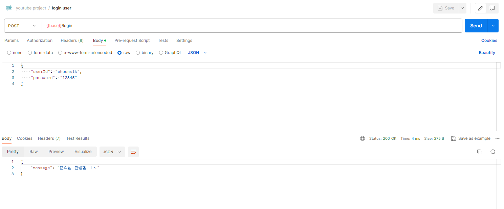
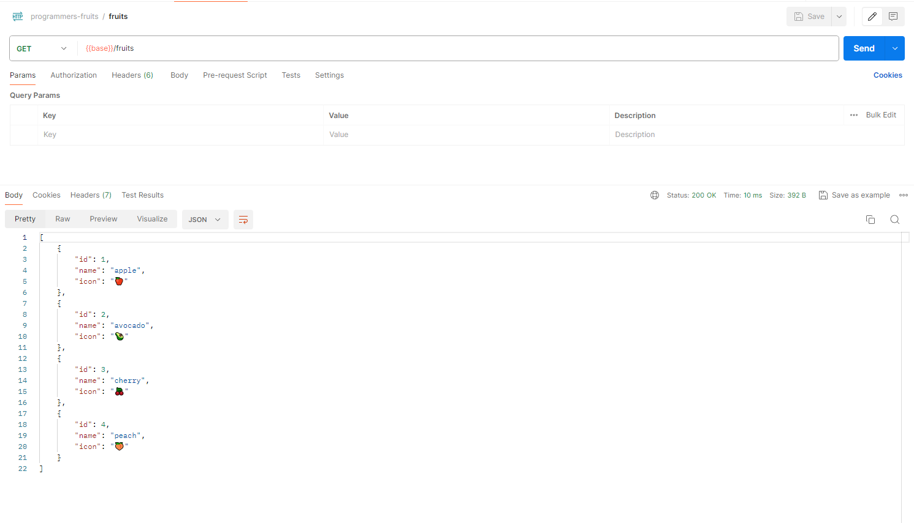
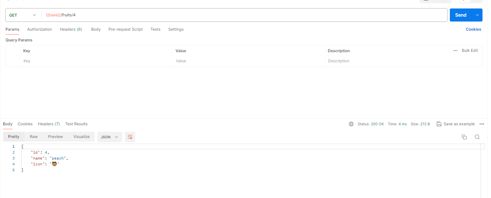
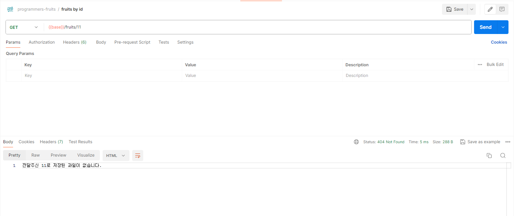

## youtube project 실행 결과

### GET /users/:id

- 회원 개별 조회
  
- 일치하는 회원 없음
  

### POST /join

- 회원 가입
  
- 중복 회원 가입
  

### POST /login

- 로그인
  
- 로그인 아이디 틀림
  
- 로그인 비번 틀림
  
- 로그인 아이디 비번 둘다 틀림
  

### DELETE /users/:id

- 회원 탈퇴
  
- 없는 회원 탈퇴
  

## expeption-demo 실행 결과

- 과일 전체 조회
  
- id 일치하는 과일 조회
  
- 존재하지 않는 id 과일 조회
  
