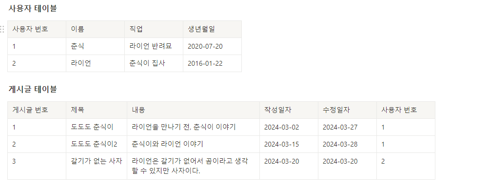

### 게시판 테이블



### 테이블 생성

- 사용자 테이블 생성

  ```sql
  CREATE TABLE users (
  	id INT NOT NULL AUTO_INCREMENT,
  	name VARCHAR(45) NOT NULL,
  	job VARCHAR(128),
  	birth DATE,
  	PRIMARY KEY (id)
  );
  ```

  

- 게시글 테이블 생성

  ```sql
  CREATE TABLE posts (
  	id INT NOT NULL AUTO_INCREMENT,
  	title VARCHAR(100) NOT NULL,
  	content VARCHAR(2000) NOT NULL,
  	created_at TIMESTAMP NOT NULL DEFAULT now(),
  	updated_at TIMESTAMP NOT NULL DEFAULT NOW() ON UPDATE NOW(),
  	userId INT NOT NULL,
  	PRIMARY KEY (id),
  	FOREIGN KEY (userId) REFERENCES users (id)
  );
  ```

  

### 데이터 추가

- 사용자 테이블 데이터 추가

  ```sql
  INSERT INTO users (name, job, birth) VALUES ("춘식", "라이언 반려묘", "2020-07-20");
  INSERT INTO users (name, job, birth) VALUES ("라이언", "춘식이 집사", "2016-01-22");
  ```

  

- 게시글 테이블 데이터 추가<br>
  여기부터는 기본 터미널이 너무 불편해서 Windows Terminal을 설치하여 사용했기 때문에 폰트가 좀 다르다.
  ```sql
  INSERT INTO posts (title, content, userId) VALUES ("도도도 춘식이", "라이언을 만나기 전, 춘식이 이야기", 1);
  INSERT INTO posts (title, content, userId) VALUES ("도도도 춘식이2", "춘식이와 라이언 이야기", 1);
  ```
  

### 게시글 수정

```sql
UPDATE posts SET title = "도도도 춘식이2(예정..?)" WHERE id = 2;
```


`title` 값과 `upated_at`의 값이 변한 것을 알 수 있다.

### 게시글 테이블 컬럼명 변경

한참 이것저것 해보다가 발견했다. 게시글 테이블을 만들때 컬럼명을 `user_id`로 만들지 않고 습관적으로 `userId`로 만들어서 수정하였다.

```sql
ALTER TABLE posts CHANGE userId user_id INT;
```


### JOIN

#### `LEFT JOIN`

- 모든 값 조회

  ```sql
  SELECT * FROM posts LEFT JOIN users ON posts.user_id = users.id;
  ```

  

- 필요한 값만 조회
  ```sql
  SELECT posts.id, title, content, created_at, updated_at, name, job, birth FROM posts LEFT JOIN users ON posts.user_id = users.id;
  ```
  
- alias 버전 조회

  ```sql
  SELECT p.id, title, content, created_at, updated_at, name, job, birth FROM posts p LEFT JOIN users u ON p.user_id = u.id;

  SELECT p.id, title, content, created_at, updated_at, name, job, birth FROM posts AS p LEFT JOIN users AS u ON p.user_id = u.id;
  ```

  

  컬럼명에도 적용해보자

  ```sql
  SELECT p.id AS "게시글 번호", title AS "제목", content AS "내용", created_at AS "작성일자", updated_at AS "수정일자", name AS "작성자 이름" FROM posts p LEFT JOIN users u ON p.user_id = u.id;
  ```

  

#### `INNER JOIN`

```sql
SELECT p.id, title, content, created_at, updated_at, name, job, birth FROM posts AS p JOIN users AS u ON p.user_id = u.id;
```


#### ❓ `RIGHT JOIN`을 하면 어떻게 될까?

```sql
SELECT p.id, title, content, created_at, updated_at, name, job, birth FROM posts p RIGHT JOIN users u ON p.user_id = u.id;
```


➡ 게시글 테이블에 라이언이 작성한 글이 없기 때문에 `NULL`로 값이 채워진다

> **INNER JOIN vs OUTER JOIN**
>
> - `LEFT OUTER JOIN`
>   - `LEFT JOIN`은 `OUTER JOIN`(합집합)의 일종으로 왼쪽 테이블의 모든 행을 조회
>   - 없는 값은 `NULL`로 채워짐
> - `RIGHT OUTER JOIN`
>   - `RIGHT JOIN`은 `OUTER JOIN`(합집합)의 일종으로 오른쪽 테이블의 모든 행을 조회
>   - 없는 값은 `NULL`로 채워짐
> - `INNER JOIN`(교집합)은 겹치지 않는 행은 결과에서 제외<br>
>   → 상대적으로 `INNER JOIN`이 성능이 더 좋다고 함
